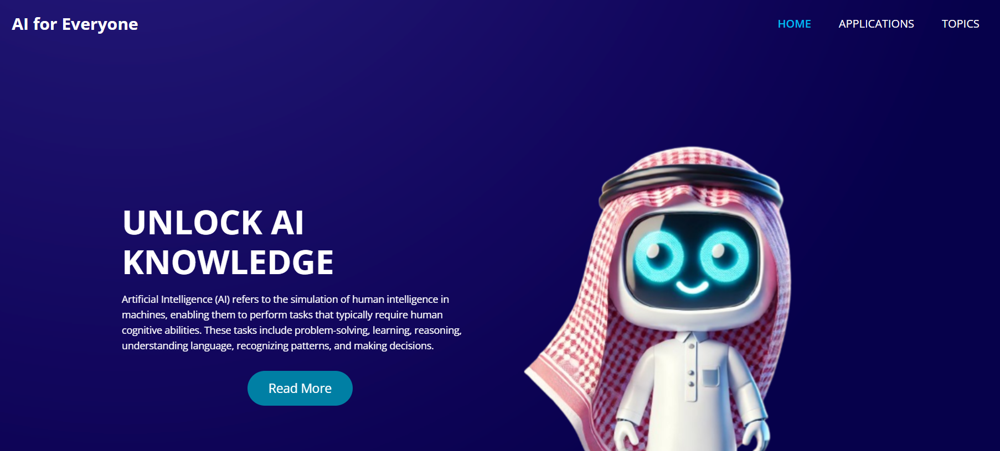

# 🤖 AI for Everyone - Educational Website

<div align="center">



[](https://developer.mozilla.org/en-US/docs/Web/HTML)
[](https://developer.mozilla.org/en-US/docs/Web/CSS)
[](https://developer.mozilla.org/en-US/docs/Web/JavaScript)
[](https://getbootstrap.com/)

**🌟 Making Artificial Intelligence Accessible to Everyone 🌟**

*A comprehensive educational platform designed to demystify AI concepts and provide practical learning resources for students, educators, and AI enthusiasts.*

</div>

---

## 📚 Table of Contents

- [🎯 About the Project](#-about-the-project)
- [✨ Features](#-features)
- [🏗️ Project Structure](#️-project-structure)
- [🚀 Getting Started](#-getting-started)
- [📖 Educational Content](#-educational-content)
- [🛠️ Technologies Used](#️-technologies-used)
- [🎮 Interactive Features](#-interactive-features)
- [📱 Applications Showcase](#-applications-showcase)
- [🤝 Contributing](#-contributing)
- [📧 Contact](#-contact)
- [📄 License](#-license)

---

## 🎯 About the Project

**AI for Everyone** is a comprehensive educational website that makes artificial intelligence concepts accessible to learners of all backgrounds. Whether you're a student, educator, or simply curious about AI, this platform provides:

- 🧠 **Clear explanations** of complex AI concepts
- 🎯 **Interactive quizzes** to test your knowledge
- 🛠️ **Practical applications** and real-world examples
- 📚 **Structured learning paths** from basics to advanced topics
- 🌍 **Cultural context** with Saudi Arabian AI initiatives

### 🎪 Special Highlights

- 🤖 **Meet Sara**: Saudi Arabia's first AI-powered humanoid robot
- 🇸🇦 **Local Context**: Features Saudi-made AI applications and initiatives
- 📱 **Mobile-First**: Fully responsive design for all devices
- 🎨 **Visual Learning**: Rich graphics and illustrations for better understanding

---

## ✨ Features

### 🎓 **Educational Excellence**
- 📖 **23 Comprehensive Topics** covering all aspects of AI
- 🧪 **Interactive Quizzes** with instant feedback and scoring
- 💡 **Code Examples** with syntax highlighting
- 📊 **Visual Learning Aids** including diagrams and infographics

### 🌐 **User-Friendly Design**
- 📱 **Responsive Layout** - Works perfectly on all devices
- 🎨 **Modern UI/UX** - Clean, intuitive interface
- ⚡ **Fast Loading** - Optimized performance
- 🔍 **Easy Navigation** - Well-organized content structure

### 🛠️ **Technical Features**
- 🎯 **Interactive Elements** - Engaging user experience
- 📈 **Progress Tracking** - Monitor your learning journey
- 🔗 **External Integrations** - Links to practical AI tools
- 📚 **Rich Content** - Comprehensive learning materials

---

## 🏗️ Project Structure

```
ai-for-everyone/
├── 📁 css/                    # Stylesheets
│   ├── style.css             # Main styles
│   ├── bootstrap.css         # Bootstrap framework
│   └── responsive.css        # Mobile responsiveness
├── 📁 js/                     # JavaScript files
│   ├── quiz.js              # Interactive quiz functionality
│   ├── custom.js            # Custom interactions
│   └── bootstrap.js         # Bootstrap components
├── 📁 images/                 # Visual assets
│   ├── indexpage.png        # Homepage screenshot
│   ├── saudi robot 2.png    # AI robot images
│   └── [100+ educational images]
├── 📁 fonts/                  # Web fonts
├── 📁 highlight/              # Code syntax highlighting
├── 📄 index.html             # Homepage
├── 📄 Topics.html            # Topics overview
├── 📄 applications.html      # Applications showcase
└── 📄 [20+ topic pages]      # Individual learning modules
```

---

## 🚀 Getting Started

### 📋 Prerequisites

- 🌐 Modern web browser (Chrome, Firefox, Safari, Edge)
- 📱 Internet connection for external resources
- 💻 Local web server (optional, for development)

### 🔧 Installation

1. **Clone the repository**
   ```bash
   git clone https://github.com/yourusername/ai-for-everyone.git
   ```

2. **Navigate to the project directory**
   ```bash
   cd ai-for-everyone
   ```

3. **Open in your browser**
   ```bash
   # Simply open index.html in your web browser
   # Or use a local server:
   python -m http.server 8000
   # Then visit: http://localhost:8000
   ```

### 🎉 That's it! 
Your AI learning journey begins now! 🚀

---

## 📖 Educational Content

### 🏁 **Introduction & Fundamentals**
- 🤖 **About AI** - History, types, and core concepts
- 📜 **AI History** - From 1950s to present day
- ⚖️ **Benefits & Risks** - Exploring AI's impact
- 🔮 **Future of AI** - Predictions and possibilities

### 🧠 **Core Technologies**
- 🎯 **Machine Learning Basics** - Supervised, unsupervised, reinforcement
- 🧬 **Deep Learning** - Neural networks and advanced concepts
- 🗣️ **Natural Language Processing** - How AI understands language
- 🎮 **Reinforcement Learning** - AI that learns through interaction

### 🌍 **Real-World Applications**
- 🏥 **AI in Healthcare** - Medical diagnostics and treatment
- 🎓 **AI in Education** - Personalized learning experiences
- 🏢 **AI in Society** - Daily life applications
- 🤖 **AI & Robotics** - Autonomous systems and robots

### ⚖️ **Ethics & Responsibility**
- 🛡️ **AI Ethics** - Moral principles and guidelines
- 🔒 **Privacy & Security** - Protecting user data
- 📊 **Bias & Fairness** - Ensuring equitable AI systems

---

## 🛠️ Technologies Used

<div align="center">

| Technology | Purpose | Version |
|------------|---------|---------|
|  | Structure & Content | HTML5 |
|  | Styling & Layout | CSS3 |
|  | Interactivity | ES6+ |
|  | Responsive Framework | 4.x |
|  | DOM Manipulation | 3.4.1 |

</div>

### 🔧 **Additional Libraries**
- 🎨 **Highlight.js** - Code syntax highlighting
- 🦉 **Owl Carousel** - Image sliders and carousels
- 🎯 **Font Awesome** - Icons and visual elements
- 🔤 **Google Fonts** - Typography (Roboto family)

---

## 🎮 Interactive Features

### 📝 **Smart Quizzes**
- ✅ **Multiple Choice Questions** with instant feedback
- 📊 **Progress Tracking** with visual progress bars
- 🎯 **Adaptive Scoring** with encouraging messages
- 🔄 **Navigation Controls** (Previous/Next/Submit)

### 💻 **Code Examples**
- 🌙 **Dark Theme** syntax highlighting
- 🐍 **Python Examples** for machine learning
- 📋 **Copy-Paste Ready** code snippets
- 📚 **Comprehensive Comments** for learning

### 🎨 **Visual Learning**
- 🖼️ **Rich Illustrations** for complex concepts
- 📊 **Infographics** and diagrams
- 🎭 **Interactive Elements** and hover effects
- 📱 **Responsive Images** for all screen sizes

---

## 📱 Applications Showcase

### 👨‍🎓 **For Students & Trainees**
- 🤖 **ChatGPT** - AI conversational assistant
- 📚 **Bites** - Smart study tool with flashcards
- 🎓 **Khan Academy** - Personalized learning paths
- 🔍 **Socratic** - Google's homework helper
- ✍️ **Grammarly** - AI writing assistant
- 🌍 **Duolingo** - AI-powered language learning
- 📝 **Otter.ai** - Real-time transcription
- 📱 **Faleh** - Saudi personal assistant app

### 👨‍🏫 **For Teachers & Educators**
- 🎯 **Magic School** - AI lesson planning
- 📊 **Nearpod** - Interactive presentations
- 🎮 **Kahoot** - Gamified learning
- 📝 **CoGrader** - Automated grading
- 🎬 **EdPuzzle** - Interactive video lessons
- 🎨 **Canva Magic Studio** - AI design tools
- 📈 **Education Copilot** - Teaching assistant
- 🎤 **Gamma** - AI presentation maker

---

## 🤝 Contributing

We welcome contributions from the community! Here's how you can help:

### 🌟 **Ways to Contribute**
- 🐛 **Report Bugs** - Found an issue? Let us know!
- 💡 **Suggest Features** - Have ideas for improvement?
- 📝 **Improve Content** - Help us make explanations clearer
- 🌍 **Translations** - Make AI accessible in more languages
- 🎨 **Design Improvements** - Enhance the visual experience

### 📋 **Contribution Guidelines**
1. 🍴 Fork the repository
2. 🌿 Create a feature branch (`git checkout -b feature/AmazingFeature`)
3. 💾 Commit your changes (`git commit -m 'Add some AmazingFeature'`)
4. 📤 Push to the branch (`git push origin feature/AmazingFeature`)
5. 🔄 Open a Pull Request

---

## 📧 Contact

<div align="center">

**🤖 AI for Everyone Team**

📧 **Email:** [azooooz2021@gmail.com](mailto:azooooz2021@gmail.com)  
🏢 **Location:** Saudi Arabia, MUB ITC Aramco  
🐦 **Twitter:** [@YourTwitterHandle](https://twitter.com/YourTwitterHandle)  
💼 **LinkedIn:** [Your LinkedIn Profile](https://linkedin.com/in/yourprofile)

*"Making AI accessible to everyone, one learner at a time"* ✨

</div>

---

## 📄 License

This project is licensed under the MIT License - see the [LICENSE](LICENSE) file for details.

### 🎉 **What this means:**
- ✅ **Free to use** for personal and commercial projects
- ✅ **Modify and distribute** as you wish
- ✅ **No warranty** - use at your own risk
- ✅ **Attribution appreciated** but not required

---

<div align="center">

## 🌟 **Star this repository if you found it helpful!** ⭐

### 🚀 **Ready to start your AI journey?**

[**🎯 Visit the Website**](https://yourusername.github.io/ai-for-everyone) | [**📚 Explore Topics**](Topics.html) | [**🛠️ Try Applications**](applications.html)

---

**Made with ❤️ for the AI community**

*Empowering minds, one algorithm at a time* 🧠✨

</div>
